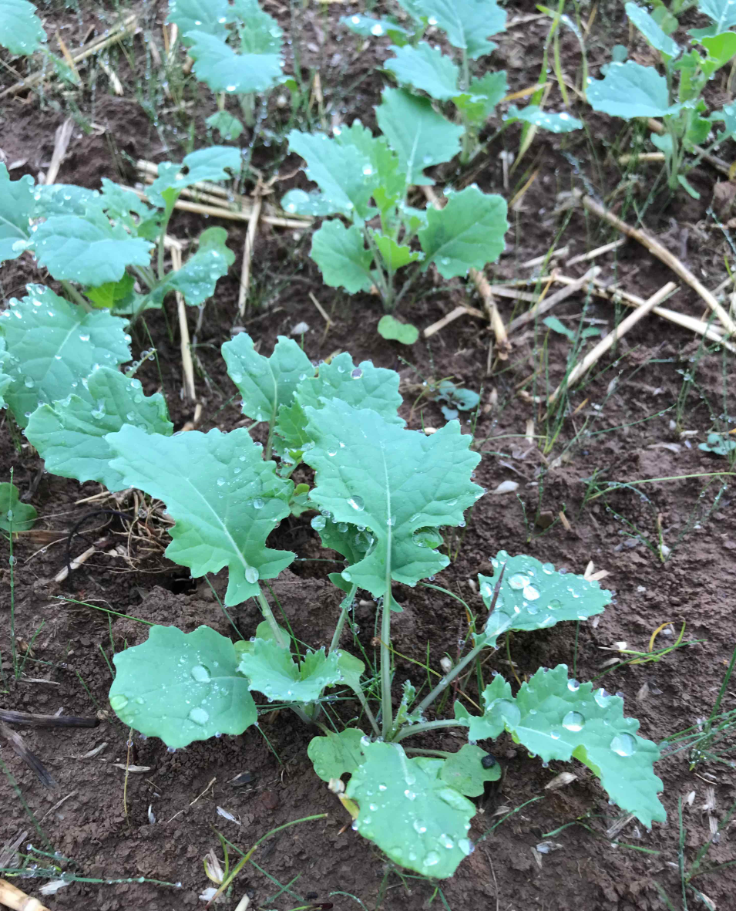
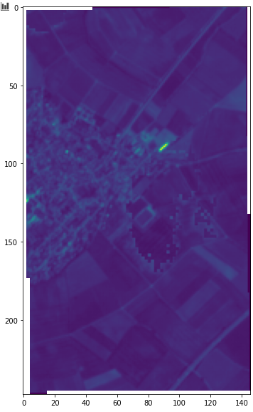
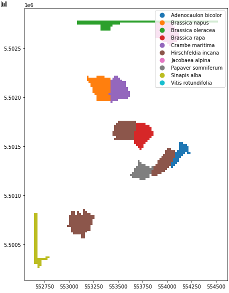

# findus

An explorative library for crop field sample data generation via smartphone and open data.

## Project Scope

With satellite missions like the Sentinels, a huge amount of remote sensing data is publicly available. Yet, in order to use this data for training machine learning algorithms for e.g. crop type classification, a large set of training data is of utterly importance. 

The base idea of findus is to easily create remote sensing training data by taking sample photographs via smartphone. The taken crop photographs are then sent via an open API to PlantNet for classification. The supplied gps information (location and direction of sight) of the photo is taken and combined with segments obtained of analysis of Sentinel 2 scenes. By supplying smartphone photos of crop fields, findus transforms this information to supply in the end classified crop types with field boundaries, which can subsequently be used for training all kinds of machine learning algorithms. The code of findus is not yet a ready-to-use package, but more a creative and explorative collection of ideas.

## Short Introduction

Here is an example sketching the idea and intended scope of the findus project. 

### 1. Provide Crop Photographs

In order to work with findus, a set of crop photographs must be taken. For robust results, the photos should satisfy the following criteria:
* photos should be taken at the center of a field edge
* camera should point towards the center of the field
* the photo should be a close-up covering prominent crop type features
* gps information about position and viewing direction should be saved
* no explicite resolution requirements must be satesfied



*A suitable photograph to be used with findus could look like this.*

### 2. Create Samples from Photographs

In findus a set of crop photographs is bundled in an instance of `CropPhotoSamples` offered by module `findus.sampling.crop_photo_sampling`. Following code block would create a new sample starting from a set of jpegs, plot the spatial distribution and finally save the current samples.

```
from findus.sampling.crop_photo_sampling import CropPhotoSamples

example_samples = CropPhotoSamples().add_samples(photo_directory='data/example_photos/')
example_samples.samples.plot()
example_samples.save_samples(saving_path='data/example_samples.json')
```

### 3. Classify Samples with PlantNet

In order to determine the crop type of each photo automatically, the free API of [PlantNet](https://plantnet.org/en/) can be used. This is usually limited to 50 classifications per day for the free version. The following section creates crop photo samples from an existent set, initialized with a PlantNet API key (saved before in a json credential file), requests classification for the photos, takes a look at the outcomes and finally saves again the samples.
```
from findus.sampling.crop_photo_sampling import CropPhotoSamples
from findus.credentials import PlantNetCredentials

example_samples = CropPhotoSamples(init_path='data/example_samples.json', 
                                   plant_net_credentials=PlanNetCredentials.load('../credentials/plant_net.json'))
example_samples.classify_samples()                               
print(example_samples.samples)
example_samples.save_samples(saving_path='data/example_samples.json')
```

### 4. Create Area of Interest for Sentinel 2 Data Download

In order to automatically derive field boundaries, a data set of Sentinel 2 images with an area of interest covering the crop photo samples has to be donwloaded and processed. 

A bounding box for the crop photo samples area of interest can be created by

```
from shapely.geometry import box
import numpy as np

bounding_box = box(*example_samples.samples.total_bounds)
bounding_box_coords = [[bounding_box.exterior.coords.xy[0][i % 4],
                        bounding_box.exterior.coords.xy[1][i % 4]] for i in np.arange(5)]
```

With this, we can create a new area of interest. For the data download later, it is necessary to supply login credentials for [Copernicus](https://www.copernicus.eu/).

```
from findus.sentinel import AOI
from findus.credentials import CopernicusCredentials

copernicus_credentials = CopernicusCredentials().load(path='../credentials/copernicus.json')
aoi = AOI(bounds=bounding_box,
          name='ExampleAOI',
          base_directory='../data/AOI/',
          copernicus_credentials=copernicus_credentials,
          target_bands=['B02', 'B03', 'B04'])

aoi.request_data(min_date='20200501',
                 max_date='20200701')
```

### 5. Download and Process Sentinel 2 Data

For a user specified time range, meta information of available products can be requested. The available products for the given time range are ordered by coverage. Subsequently, we can now download the first three products, process those image to generate an image as cloud-free as possible, and finally perform an image segmentation via slic algorithm.

```
aoi.request_data(min_date='20200501',
                 max_date='20200701')

aoi.download_data(num_images=3)

aoi.start_raw_product_processing()
aoi.combine_processed_products(combination_function=np.nanmean)
aoi.perform_image_segmentation(band='B03')
```



*A typical outcome of findus' Sentinel 2 processing pipeline.*

### 6. Combine Classified Samples and Sentinel 2 Based Field Boundaries

In a last step, we can now combine the classified crop sample photographs with the Sentinel 2 based field boundaries to create a final data set of field samples. This might requre a coordinate transformation of the crop photo samples. It might be reasonable to also exclude samples which have a very low classification score to avoid impurities.

```
import os
from findus.sampling.field_sampling import FieldSamples

example_samples.to_crs('EPSG:32632')

field_samples = FieldSamples(crs='EPSG:32632').add_samples(crop_photo_samples=example_samples,
                                                           path_segments=os.path.join(aoi.results_directory, 'segments.tif'),
                                                           minimum_classification_score=0.3)
```

We should now have a new data set of labeled crop fields, ready to be used for any imaginable remote sensing application which could look like the following:



*A possible result of findus showing field boundaries with classified crop types.*

## Notes

findus is not yet anything like a product or ready-to-use solution, but more a collection of explorative ideas with some underlying code. Especially the part covering Sentinel 2 image processing is very basic and might only work for selected examples. However, this can be bypassed by either supplying hand drawn field boundaries, or by using personally derived segmentation results.
